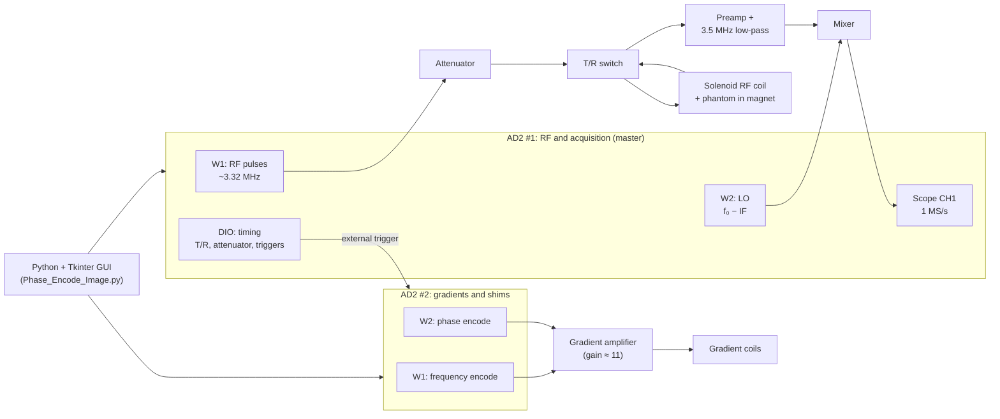
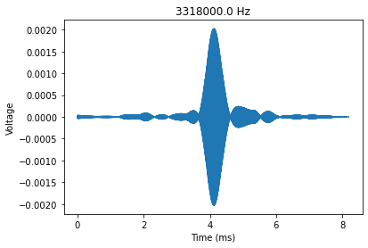
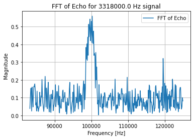
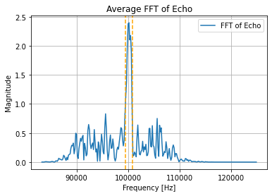
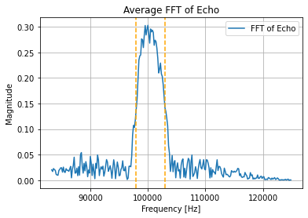
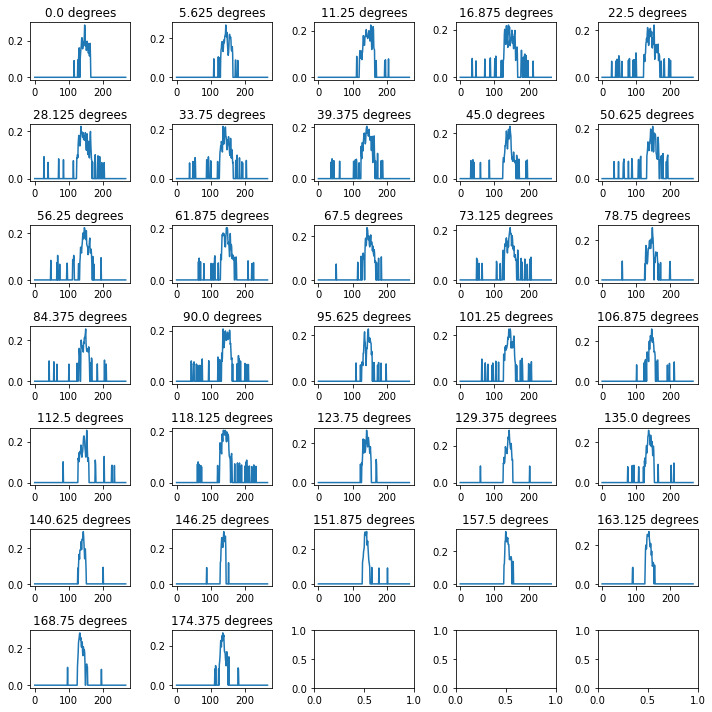
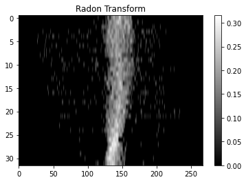

# Instrumentation and System Design for Advanced MRI Imaging

**Building a benchtop MRI scanner over one semester: from a noisy trace on a USB scope to a 2D image of a two-object phantom.**

This repository comes from the lab sequence of **MR Engineering (ECEN 463/763 · BMEN 427/627)** at Texas A&M University, Fall 2024. Over eleven labs we turned two **Digilent Analog Discovery 2 (AD2)** boards, a small permanent magnet, a hand-wound RF coil, and our own Python code into a working MRI system. This README tells the story in the order we built it, with a focus on how the code was tuned, step by step, until the phantom became visible.

**Authors:** Austin Janszen, Jen Li Kao

<p align="center">
  
  
  
  <br>
  <em>Final result (Lab 10/11). Left to right: measured k-space, the raw 2D-FFT reconstruction, and the thresholded image, where both objects of the phantom are visible.</em>
</p>

---

## Table of contents

1. [The short version](#the-short-version)
2. [System architecture](#system-architecture)
3. [Part 1: Building the hardware chain (Labs 1 to 5)](#part-1-building-the-hardware-chain-labs-1-to-5)
4. [Part 2: Finding and cleaning up the echo (Lab 6)](#part-2-finding-and-cleaning-up-the-echo-lab-6)
5. [Part 3: Gradients and shimming (Labs 7 and 8)](#part-3-gradients-and-shimming-labs-7-and-8)
6. [Part 4: First image with projection reconstruction (Lab 9)](#part-4-first-image-with-projection-reconstruction-lab-9)
7. [Part 5: Phase-encoded 2D image (Labs 10 and 11)](#part-5-phase-encoded-2d-image-labs-10-and-11)
8. [How the signal got cleaner: a summary](#how-the-signal-got-cleaner-a-summary)
9. [Lessons learned](#lessons-learned)
10. [Running the code](#running-the-code)
11. [Repository contents](#repository-contents)

---

## The short version

The signal we want is a proton spin echo from a test tube of water: a few millivolts at about **3.32 MHz**, lasting a few milliseconds, sitting right after RF pulses that are volts in size. Getting from that to a picture meant solving one problem at a time:

| Stage | Problem | What we did | Lab |
| --- | --- | --- | --- |
| Pulse sequence | Fire RF pulses and digitize at exactly the right moments | Python control of the AD2 waveform generator, scope, and digital I/O | 1 to 2 |
| Transmit / receive | The RF pulse must not reach (or saturate) the receiver | Characterized and timed an attenuator board and a T/R switch | 3 to 4 |
| RF coil | Couple efficiently to the sample at the Larmor frequency | Wound a solenoid, matched it to 50 Ω, measured its Q | 5 |
| Echo search | We did not know the exact resonance frequency | Swept the RF frequency until the echo appeared | 6 |
| Noise | The echo is hard to see in the raw capture | Down-mixing to an IF, Chebyshev band-pass, Hamming window | 6 |
| Field quality | B₀ inhomogeneity broadens the line | DC shim currents; linewidth 1953 Hz → ~1220 Hz | 8 to 9 |
| Spatial encoding | Make frequency depend on position | Ramped gradient waveforms from a second AD2, calibrated to our coils | 7 to 9 |
| Image (version 1) | Turn projections into a picture | 32 rotated-gradient projections, centering, backprojection | 9 |
| Image (version 2) | Get a true 2D Fourier image | 32 phase-encode steps, k-space windowing, 2D FFT, thresholding | 10 to 11 |

---

## System architecture



AD2 #1 is the master clock. Its digital outputs drive the attenuator, the T/R switch, its own digitizer, and an external trigger that starts the gradient waveforms on AD2 #2. Every part of the sequence therefore stays locked to the same timeline from shot to shot.

---

## Part 1: Building the hardware chain (Labs 1 to 5)

**Labs 1 and 2: the AD2 as a spectrometer.** We started from the AD2 SDK and wrote helpers that every later script reuses: `set_wavegen()` for RF bursts, `set_scope()` for triggered single acquisitions, and `set_dio()` for timing lines, which counts in 10 µs ticks. With these we built a two-pulse sequence with MRI-like timing (TE = 6 ms, predelay = TE/2), added the control lines, and learned the sampling rules the hard way: at 250 kS/s an 8 ms window is 2000 samples, and a 1 MHz test tone was visibly aliased.

**Lab 3: the transmit front end.** We measured what the hardware actually does instead of trusting nominal values. The attenuator board switches between 0 and 6 dB in about **180 ns**, and the transmit chain through the T/R switch is not linear: its insertion loss drops from ~5.7 dB at 0.5 V input to ~2.9 dB at 5 V. These measurements later set our RF amplitude range.

**Lab 4: the receive front end.** We followed the signal through the preamplifier, the 3.5 MHz low-pass filter, and the mixer. The digitizer noise floor had a standard deviation of **1.12 mV**, rising to **5 mV** after the preamplifier. The low-pass filter costs about **10.25 dB**, and the LO alone puts a DC offset on the mixer output. Knowing each of these numbers made later debugging much faster.

**Lab 5: the RF coil.** We wound a solenoid coil, measured its impedance on a NanoVNA (0.76 + j56.6 Ω), and matched it to 50 Ω with switchable capacitors. The values we calculated (746 pF / 107 pF) were not what worked on the bench, so we tuned the switches empirically to 517 pF / 47 pF. We also mapped B₀ with a Hall probe to estimate the Larmor frequency and field uniformity of our magnet station.

---

## Part 2: Finding and cleaning up the echo (Lab 6)

This is where the project became MRI. The sequence is a classic spin echo: a 90° pulse, a 180° pulse TE/2 later, and an echo at TE.

```python
predelay = (TE / 2) - Tp                     # pulse centers are TE/2 apart
set_wavegen(0, freq, amplitude, Tp, predelay, Npulse)   # W1: two RF pulses
Echo_time = 3*predelay + 2.5*Tp - (Tacq/2)  # start of a window centered on the echo
```

**Searching for the echo.** We did not know the exact resonance of our magnet, so the code swept the RF frequency from **3.2 to 3.6 MHz in 10 kHz steps**, acquiring and plotting at each step until an echo appeared. It showed up at **3.318 MHz**, and that became our center frequency.

**Heterodyne receiver.** Rather than digitize 3.3 MHz directly, W2 on AD2 #1 plays a local oscillator offset from the RF frequency, and the mixer brings the echo down to a low intermediate frequency (100 kHz at this stage). A 1 MS/s capture of 8.192 ms then gives a clean spectrum with 122 Hz bins.

**Filtering.** The raw capture is dominated by noise and a DC offset. We added a 6th-order Chebyshev type II band-pass around the IF, applied with `filtfilt` so it adds no phase shift, then a Hamming window before the FFT.

```python
b, a = cheby2(6, 40, [lowCut, highCut], btype="band")   # IF ± 10 kHz in Lab 6
rgdSamples_filt = filtfilt(b, a, rgdSamples)            # zero-phase
rgdSamples_win  = rgdSamples_filt * np.hamming(len(rgdSamples_filt))
```

| Raw capture | After band-pass + window |
| :---: | :---: |
|  |  |
|  |  |

We also raised the RF amplitude step by step (1 V to 5 V for a 500 µs pulse) until a larger drive no longer improved the echo. The best echo had an SNR of about **26 dB** in the time domain.

---

## Part 3: Gradients and shimming (Labs 7 and 8)

**A GUI for the whole sequence (Labs 7 and 8).** Retuning parameters by editing code was slowing us down, so we built a Tkinter GUI and extended it lab by lab. In its final form you enter frequency, amplitude, TE, Tp, sampling rate, Tacq, target resolution, ramp time, and averages, and it recalculates predelay, sample count, gradient strength, and the required AD2 voltage as you type. Parameter sets can be saved and loaded as CSV, and the last run is kept in `Recent.csv`.

**Gradient waveforms.** AD2 #2 plays 4096-point custom waveforms built sample by sample, started by AD2 #1's external trigger. Each lobe has linear ramps of `T_ramp` so the amplifier and coils stay within their slew limits. The script plots the waveforms before every shot so the timing can be checked by eye.

**From resolution to volts.** The GUI converts the target resolution into a gradient strength, then into the voltage the AD2 must output:

```python
G_strength  = ((1/Tacq) / resolution) / 425.7   # Hz/mm → G/cm for protons
G_strength *= 1.28 / 0.56                        # empirical correction for our coils (added in Lab 9)
V_grad      = 4 * (G_strength / 0.5)             # voltage into the gradient coils
V_AD2       = V_grad / 11                        # gradient amplifier gain ≈ 11
```

**Shimming (Lab 8).** An uneven B₀ field makes the spins dephase faster, which broadens the spectral line and weakens the echo. We added DC shim offsets on AD2 #2, limited in software to ±0.2 V to protect the coils, and measured the linewidth (FWHM) after each change:

| | Linewidth |
| --- | --- |
| Before shimming | 1953 Hz |
| After shimming (X = 0.2 V, second axis = 0.2 V) | ~1220 Hz |

<p align="center">
  
  
  <br>
  <em>Echo spectrum before shimming (left) and after shimming (right, 1250 Hz linewidth in Lab 9).</em>
</p>

We then worked out how strong the gradient had to be so that gradient broadening would dominate the residual linewidth by an order of magnitude. For a 2500 Hz gradient-dominated line, that came to about **447 Hz/mm (1.05 G/cm)**.

---

## Part 4: First image with projection reconstruction (Lab 9)

With a shimmed echo (linewidth **1250 Hz**) we verified the gradients one axis at a time. Turning a gradient on spreads the line into a projection of the sample: **5000 Hz** wide with the Z gradient and **4531 Hz** with the X gradient.

| Shimmed echo, no gradient | Same sample, Z gradient on |
| :---: | :---: |
|  |  |

To make an image we rotated the readout gradient by mixing the two axes, then acquired one projection per angle:

```python
theta = n * np.pi / num_projections
GxWFRM[i] = GxWFRM[i] * gradient_scale * np.sin(theta)
GzWFRM[i] = GzWFRM[i] * gradient_scale * np.cos(theta)
```

We started with 8 projections, then went to 16 and 32. Getting a recognizable image out of the projections took several rounds of tuning:

1. **Wider filter.** Gradients spread the signal over several kHz, so the band-pass grew from IF ± 10 kHz to ± 20 kHz and finally ± 40 kHz.
2. **Shim retuned** (X = 0.2 V, Z = −0.1 V).
3. **Gradient calibration.** The two axes gave different spreads for the same requested resolution (5000 Hz vs 4531 Hz), so we added the empirical `1.28 / 0.56` correction and a per-axis scale factor.
4. **Centering each projection.** The projections drifted off center from angle to angle, which blurs a backprojection badly. We shifted each projection back to a common center before reconstruction.
5. **Noise floor removal.** Values below 30 % of each projection's peak were set to zero.
6. **Backprojection.** We stacked the projections into a sinogram and reconstructed with `skimage.transform.iradon`, comparing plain backprojection with Hamming-filtered backprojection.

| 32 projections | Sinogram | Backprojection |
| :---: | :---: | :---: |
|  |  |  |

This gave our first image of the "mystery phantom". It also showed the limits of the approach: every small error in alignment or calibration smears across the whole image.

---

## Part 5: Phase-encoded 2D image (Labs 10 and 11)

For the final image we switched to **phase encoding** with a Fourier reconstruction. This is the method used in clinical scanners. Each shot now has two gradients:

- **Frequency encoding (AD2 #2, W1):** a dephase lobe starting right after the 90° pulse, then a readout lobe centered on the echo.
- **Phase encoding (AD2 #2, W2):** a lobe played at the same time as the dephase lobe, whose amplitude changes from shot to shot.

**32 lines of k-space.** The sequence repeats 32 times, stepping the phase-encode amplitude from −G<sub>max</sub> to +G<sub>max</sub>:

```python
Npe = 32
Phase_encode_steps  = np.linspace(-Gpe_max, Gpe_max, Npe)
Phase_encode_steps += np.min(np.abs(Phase_encode_steps))   # make one step exactly zero
```

A symmetric 32-point grid has no zero. The shift makes one step land exactly at zero, so the **center of k-space**, where most of the signal energy is, is actually sampled.

**Acquisition changes for the final run.** We moved the IF to **200 kHz** and kept the ± 40 kHz zero-phase band-pass. Zero phase matters even more here, because phase encoding stores position in the signal's phase. Each step's spectrum is averaged and saved to `phase_encode_data_<n>_v1.txt`.

**Reconstruction** ([`Phase_Encode_reconstruction.py`](Phase_Encode_reconstruction.py)). We first developed this on the course's example data set, then applied it to our own scans:

1. **Isolate the signal.** Keep the 64 FFT bins around the 200 kHz IF and discard the rest of the spectrum.
2. **Build k-space.** Inverse-FFT each 64-bin slice back to the time domain to get one k-space line, then stack the 32 lines into a 32 × 64 matrix.
3. **2D Hamming apodization.** `outer(hamming(32), hamming(64))` tapers the edges of k-space and suppresses the ringing caused by having so few samples.
4. **2D FFT and magnitude.**
5. **Re-centering.** An empirical `np.roll` shift moves the objects to the middle of the field of view.
6. **Threshold.** Pixels below 20 % of the maximum are set to zero, which removes the speckled background.

```python
k_space_data *= np.outer(np.hamming(Npe), np.hamming(64))
magnitude_image = np.abs(np.fft.fft2(k_space_data))
magnitude_image[magnitude_image <= 0.2 * np.max(magnitude_image)] = 0
```

| k-space | Raw reconstruction | After thresholding |
| :---: | :---: | :---: |
|  |  |  |
| Energy concentrated at the center | Both objects visible over a noisy background | Background removed |

The reconstruction matched the layout of the two-object phantom and stayed consistent when we changed the resolution and the number of projection angles. One of the objects still showed artifacts; we suspect environmental factors such as magnet temperature drift or electromagnetic interference in the lab. The slides we presented are in [`Final_Image_Result.pdf`](Final_Image_Result.pdf).

---

## How the signal got cleaner: a summary

| Step | Change in the code | Effect |
| --- | --- | --- |
| Frequency sweep | Loop RF over 3.2 to 3.6 MHz | Found the resonance at 3.318 MHz |
| Echo-centered trigger | `Trig_AD2 = 3*predelay + 2.5*Tp − Tacq/2` | Acquisition window sits on the echo |
| Down-mixing | LO at f₀ − IF on AD2 #1 W2 | Echo moved to 100 kHz, later 200 kHz |
| Band-pass | Chebyshev II, order 6, `filtfilt` | Noise and DC removed with no phase distortion |
| Window | Hamming before the FFT | Less spectral leakage |
| Averaging | Sum spectra over `Num Averages` shots | Noise averages down, echo adds up |
| Shimming | DC offsets on AD2 #2 | Linewidth 1953 Hz → ~1220 Hz |
| Gradient calibration | `× 1.28 / 0.56` plus per-axis scale | Gradient spread matches the requested resolution |
| Projection centering | Per-angle shift before backprojection | Sharper projection-reconstruction image |
| k-space window | 64 bins around the IF + 2D Hamming | Less noise and ringing in the 2D image |
| Threshold | Zero pixels below 20 % of max | Clean background, objects stand out |

---

## Lessons learned

- **Timing is everything.** The attenuator, T/R switch, LO, digitizer, and gradients have to line up to within microseconds. Using one AD2 as the master trigger for the other made that possible.
- **Measure the hardware.** Calculated matching capacitors, nominal insertion losses, and theoretical gradient strengths all needed correcting against bench measurements.
- **Protect the phase.** Zero-phase filtering and a sampled k-space center were essential for phase encoding.
- **Small misalignments matter.** In projection reconstruction a few bins of drift per angle visibly blurred the image until we re-centered every projection.
- **Low-field MRI is sensitive to its surroundings.** Temperature drift and electromagnetic interference remained the main limits on image quality.

---

## Running the code

### Requirements

- **Hardware:** 2 × Digilent Analog Discovery 2, a low-field magnet, a tuned and matched RF coil, the RF front end (attenuator, T/R switch, preamp, mixer), and gradient and shim coils with an amplifier (gain ≈ 11)
- **Software:** Python 3, [Digilent WaveForms](https://digilent.com/reference/software/waveforms/waveforms-3/start), and `dwfconstants.py` from the WaveForms SDK samples (`WaveForms/samples/py/`) placed next to the scripts
- **Python packages:** `pip install numpy scipy matplotlib` (`tkinter` ships with Python)

### 1. Acquire

```bash
python Phase_Encode_Image.py
```

Set the parameters in the GUI and press **Run**:

| Parameter | Default | Meaning |
| --- | --- | --- |
| Frequency (MHz) | 3.34 | RF frequency (set it to your measured resonance; ours was 3.318 MHz) |
| Amplitude (V) | 1 | RF amplitude |
| TE (ms) | 10 | Echo time |
| Tp (µs) | 25 | RF pulse width |
| Npulse | 2 | Number of RF pulses |
| sampFreq | 1 000 000 | Digitizer sample rate (Hz) |
| Tacq (ms) | 8.192 | Acquisition window |
| Resolution (mm) | 333 | Target resolution (sets gradient strength) |
| T_ramp (ms) | 5 | Gradient ramp time |
| Num Averages | 1 | Averages per phase-encode step |
| Filtering / Window / Gradient / Shim | on | Enable each stage |

Shim offsets are set in the code (`offset0`, `offset1`, limited to ±0.2 V). They are 0 V in the committed version. The scan writes `phase_encode_data_0_v1.txt` … `phase_encode_data_31_v1.txt`.

### 2. Reconstruct

Set `directory` in `Phase_Encode_reconstruction.py` to the folder containing the data files, then run:

```bash
python Phase_Encode_reconstruction.py
```

---

## Repository contents

| File | Description |
| --- | --- |
| [`Phase_Encode_Image.py`](Phase_Encode_Image.py) | Acquisition: parameter GUI, AD2 control, spin-echo sequence, gradients, shims, filtering, data capture |
| [`Phase_Encode_reconstruction.py`](Phase_Encode_reconstruction.py) | Reconstruction: k-space assembly, 2D Hamming window, 2D FFT, thresholding |
| [`Final_Image_Result.pdf`](Final_Image_Result.pdf) | Final presentation slides |
| [`images/`](images) | Figures from Labs 6, 8, 9, and 10 used in this README |

The earlier lab scripts (echo search, projection reconstruction) are not included in this repository. The figures from those stages are kept in `images/` to document the process.

## License

Released under the [MIT License](LICENSE).
