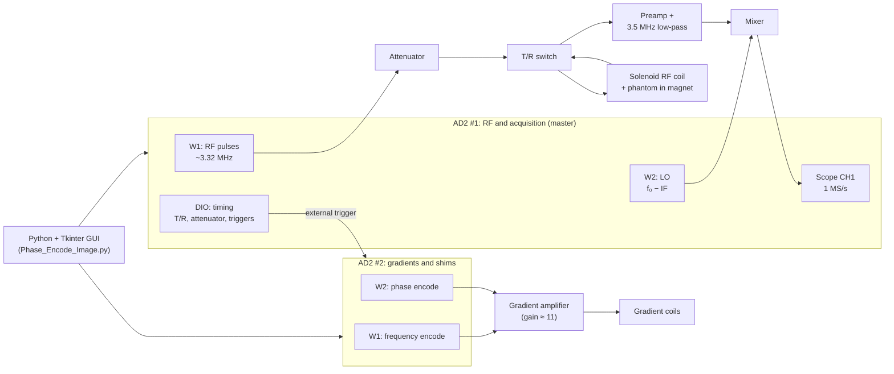

# Instrumentation and System Design for Advanced MRI Imaging

**A low-cost benchtop MRI scanner built from two USB oscilloscope boards, a permanent magnet, a hand-wound RF coil, and custom Python software. It takes a phantom from a noisy millivolt echo to a 2D image.**

**Team:** Austin Janszen, Jen Li Kao · Texas A&M University · Fall 2024

<p align="center">
  
  
  
  <br>
  <em>Final result. Left to right: measured k-space, the 2D-FFT reconstruction, and the cleaned image, where both objects of the phantom are visible.</em>
</p>

---

## Table of contents

1. [Project overview](#project-overview)
2. [Goals](#goals)
3. [Preparation](#preparation)
4. [System architecture](#system-architecture)
5. [Implementation](#implementation)
6. [Results](#results)
7. [Challenges and lessons learned](#challenges-and-lessons-learned)
8. [Limitations and future work](#limitations-and-future-work)
9. [Getting started](#getting-started)
10. [Repository structure](#repository-structure)

---

## Project overview

Clinical MRI scanners rely on superconducting magnets and dedicated hardware worth millions of dollars. This project asks how much of that can be reproduced on a lab bench. We used two **Digilent Analog Discovery 2 (AD2)** boards, a low-field permanent magnet (proton resonance ≈ 3.32 MHz), and our own control and reconstruction software.

The signal we start from is a proton spin echo from a water phantom. It is a few millivolts in size, lasts a few milliseconds, and arrives right after RF pulses that are volts in size. The project builds the full chain needed to turn that signal into an image: pulse sequencing, the transmit/receive front end, signal processing, shimming, gradient encoding, and image reconstruction.

**Key outcomes**

- A complete, software-defined MRI system controlled from a single Python GUI
- RF coil matched to 50 Ω with **−34.8 dB** return loss at 3.30 MHz
- Echo detected at **3.318 MHz** with a time-domain SNR of about **26 dB**
- Spectral linewidth reduced from **1953 Hz to ~1220 Hz** by shimming
- A first image from **32-angle projection reconstruction**
- A final **32 × 64 phase-encoded 2D Fourier image** that matches the layout of a two-object phantom

---

## Goals

| # | Objective | Success criterion |
| --- | --- | --- |
| 1 | Build a working spectrometer from general-purpose instruments | RF pulses, receiver gating, and digitization synchronized to within microseconds |
| 2 | Reliably detect a spin echo | Echo clearly visible above the noise at a known resonance frequency |
| 3 | Improve signal quality | Narrower linewidth and higher SNR through shimming and signal processing |
| 4 | Encode spatial information | Calibrated gradients whose spectral spread matches the requested resolution |
| 5 | Produce a 2D image | A reconstruction that matches the geometry of the phantom |

---

## Preparation

Before writing any imaging code, we assembled the hardware and measured how each block actually behaved, instead of relying on nominal values. These measurements set the operating limits used in the rest of the project.

### Hardware

| Component | Role |
| --- | --- |
| 2 × Digilent Analog Discovery 2 | AD2 #1: RF transmit, local oscillator, digitizer, timing lines. AD2 #2: gradient and shim waveforms |
| Low-field permanent magnet | B₀ field, proton resonance ≈ 3.32 MHz |
| Hand-wound solenoid RF coil | Transmits the RF pulses and receives the echo |
| Attenuator board, T/R switch | Shape the transmit pulse and isolate the receiver |
| Preamplifier, 3.5 MHz low-pass filter, mixer | Receive chain and down-conversion |
| Gradient and shim coils + amplifier (gain ≈ 11) | Spatial encoding and field correction |
| NanoVNA, Hall probe | Coil characterization and B₀ mapping |

<p align="center">
  
  <br>
  <em>The RF front end on the bench: attenuator, T/R switch, preamplifier, 3.5 MHz low-pass filter, and mixer, powered from a 12 V supply.</em>
</p>

### Software

- Python 3 with NumPy, SciPy, and Matplotlib
- Digilent WaveForms SDK (`dwf` library and `dwfconstants.py`)
- Tkinter for the control GUI

### Hardware characterization

| Block | What we measured | Result and how we used it |
| --- | --- | --- |
| Attenuator | Switching speed and insertion loss | Switches 0 ↔ 6 dB in ~180 ns, fast enough to gate within a pulse sequence. Adds a steady ~1.8 dB beyond its 6 dB setting across 1.5–4.7 V input |
| T/R switch | Insertion loss vs. drive level (attenuator contribution removed) | Non-linear: ~5.7–5.9 dB up to 2 V input, falling to ~2.9 dB at 5 V. Low-amplitude pulses lose more power, which set our usable RF amplitude range |
| Receive chain | Noise and signal level at each test point | Noise floor (std) 1.12 mV at the digitizer → 5 mV after the preamp. Low-pass filter loss ≈ 10.25 dB. A 1.3 V preamp output dropped to 0.85 V at the mixer (conversion loss). We swept the LO drive (1.5 / 2.0 / 2.5 V) and kept **1.5 V**. The LO alone puts a DC offset on the mixer output, and terminating the coil port in 50 Ω visibly lowered the noise |
| RF coil | Impedance, Q, and matching | Measured 0.76 + j56.6 Ω at 3.3 MHz, far from the 1.71 + j102.6 Ω estimated beforehand, so we recalculated the matching network. The calculated capacitors (746 pF / 107 pF) still did not work on the bench, so we tuned them empirically to 517 pF / 47 pF. Result: 49.5 − j1.75 Ω, S11 = −34.8 dB (VSWR 1.04) at 3.30 MHz. Unloaded Q ≈ 74 |
| Magnet | B₀ map with a Hall probe | Estimated the Larmor frequency and field uniformity at the sample position |

<p align="center">
  
  <br>
  <em>Transmit-path insertion loss measured with a swept drive level. The attenuator is flat, while the T/R switch loses less power at higher drive.</em>
</p>

<p align="center">
  
  <br>
  <em>The matched RF coil on the NanoVNA: the Smith chart passes through 50 Ω and S11 dips to −34.8 dB at 3.30 MHz.</em>
</p>

**Receiver bring-up checklist.** These measurements also gave us a quick test routine to run before each session:

1. Confirm 12 V at the preamplifier supply.
2. Inject a known sine wave above 3 MHz into a 50 Ω-terminated input.
3. Measure the signal at each test point (preamp, low-pass, IF) and compare with the reference levels above.
4. Check the noise floor at each point.
5. Apply the LO and confirm the IF output sits at the expected frequency and amplitude.

### Signal and timing groundwork

Before connecting the magnet, we checked the signal-processing and instrument-control basics the whole system depends on.

**RF pulse bandwidth.** We modeled a sinc RF pulse in Python and examined its spectrum with an FFT. With 16 lobes on each side, the first zero crossing falls at **187.5 µs** and the spectrum is a flat band about **10.7 kHz** wide. Shorter or more-lobed pulses excite a wider band of frequencies. This trade-off guided our choice of pulse widths later.

| Sinc RF pulse (16 lobes) | Its spectrum |
| :---: | :---: |
|  |  |

**Triggering and sampling.** We positioned the digitizer trigger with a DIO edge so that acquisition starts at a chosen point in the sequence. We also verified the sample budget, for example 250 kS/s × 8 ms = 2000 samples. A 1 MHz test tone sampled at 250 kS/s was clearly aliased. Since the sampling rate must be at least twice the signal frequency, we later down-mixed the echo and captured it at 1 MS/s with an 8.192 ms window (122 Hz bins).

**Custom waveforms.** We programmed arbitrary waveforms on the AD2 and controlled them in software:

- ramp length, set through the playback frequency (1 kHz gives a 1 ms ramp, 2 kHz gives 0.5 ms)
- start delay, set with `AnalogOutWaitSet`
- ramp-up / ramp-down shapes
- output on either channel

These became the building blocks of the gradient lobes.

**Repetition time.** We wrapped the acquisition in a loop with a programmable repetition time (TR). For a 6 s target the measured TR was about 6.2 s, so we knew how much overhead each shot adds.

**First pulse sequence.** Putting these pieces together, we built a two-pulse sequence with MRI-like timing (TE = 6 ms, predelay = TE/2), a ramp waveform on the second channel, and the T/R switch and pulse-control lines on DIO 2 and DIO 3. This was the skeleton of the final imaging sequence.

| Two RF pulses + ramp waveform | Timing control lines |
| :---: | :---: |
|  |  |

---

## System architecture



AD2 #1 is the master clock. Its digital outputs drive the attenuator, the T/R switch, its own digitizer, and an external trigger that starts the gradient waveforms on AD2 #2. Every part of the sequence therefore stays locked to the same timeline from shot to shot.

---

## Implementation

The project was carried out in six phases. Each phase built on the previous one and solved one specific obstacle between the raw signal and the final image.

| Phase | Focus | Obstacle | Solution |
| --- | --- | --- | --- |
| 1 | Control software | Fire RF pulses and digitize at exactly the right moments | Python driver layer for the AD2 and a parameter GUI |
| 2 | Echo detection | Unknown exact resonance; echo buried in noise | Frequency sweep, heterodyne receiver, zero-phase filtering |
| 3 | Field optimization | B₀ inhomogeneity broadens the line | DC shimming with linewidth feedback |
| 4 | Spatial encoding | Make frequency and phase depend on position | Ramped, calibrated gradient waveforms on a second AD2 |
| 5 | Prototype imaging | Turn spatially encoded signals into a picture | 32-angle projection reconstruction |
| 6 | Final imaging | Higher-fidelity 2D image | Phase encoding and 2D Fourier reconstruction |

### Phase 1: Control software and pulse sequence

Building on the [groundwork](#signal-and-timing-groundwork), we wrapped the WaveForms SDK in a small driver layer that all later code reuses:

- `set_wavegen()` generates RF bursts and the local oscillator
- `set_scope()` sets up a triggered single acquisition
- `set_dio()` drives the timing lines, counting in 10 µs ticks

The core sequence is a **spin echo**: a 90° pulse, a 180° pulse TE/2 later, and an echo at TE. The digitizer trigger is computed so that the acquisition window is centered on the echo:

```python
predelay  = (TE / 2) - Tp                       # pulse centers are TE/2 apart
set_wavegen(0, freq, amplitude, Tp, predelay, Npulse)   # W1: two RF pulses
Trig_AD2  = 3*predelay + 2.5*Tp - (Tacq/2)      # window centered on the echo
```

**Synchronizing two AD2s.** Arming one device is not enough. Both boards are armed, and AD2 #2's digital output is explicitly configured before AD2 #1 fires the sequence. Without that extra step, the gradient board never saw the trigger:

```python
set_ad2_device(1); arm_dio(SeqTime); arm_analog()     # gradient board
set_ad2_device(0); arm_dio(SeqTime); arm_analog()     # RF / acquisition board
set_ad2_device(1); dwf.FDwfDigitalOutConfigure(hdwf, c_int(1))   # required for AD2 #2
set_ad2_device(0); trigger_and_read_ch0(rgdSamples, numSamp)    # fire and acquire
```

The receiver is protected by two timing lines: the T/R switch (DIO 2) and the attenuator (DIO 3). The T/R window opens 50 µs before the first pulse and closes 110 µs after the second, which leaves margin for coil ring-down.

Retuning parameters by editing code was slow, so we built a **Tkinter GUI**. It started as a small standalone gradient-strength calculator and grew into the control panel for the whole sequence. You enter frequency, amplitude, TE, Tp, sampling rate, Tacq, target resolution, ramp time, and number of averages. The GUI recalculates predelay, sample count, gradient strength, and the required AD2 voltage as you type. Parameter sets can be saved and loaded as CSV files, and the last run is kept in `Recent.csv`.

### Phase 2: Echo detection and signal conditioning

**Finding the resonance.** The exact Larmor frequency of our magnet was unknown, so we ran a coarse sweep from **3.2 to 3.6 MHz in 10 kHz steps**, then a fine sweep from **3.30 to 3.34 MHz in 2 kHz steps**, acquiring and plotting at each step. The echo appeared at **3.318 MHz**, which became our operating frequency.

**Heterodyne receiver.** Instead of digitizing 3.3 MHz directly, W2 on AD2 #1 generates a local oscillator offset from the RF frequency. The mixer then brings the echo down to a low intermediate frequency (IF): 100 kHz at first, and 200 kHz in the final system. A 1 MS/s capture covers this comfortably.

**Filtering.** The raw capture is dominated by noise and a DC offset from the mixer. We apply a 6th-order Chebyshev type II band-pass around the IF using `filtfilt`, which is zero-phase, so the filter does not distort the signal phase. A Hamming window before the FFT reduces spectral leakage. Spectra from repeated shots can be averaged to lower the noise further.

```python
b, a = cheby2(6, 40, [lowCut, highCut], btype="band")
rgdSamples_filt = filtfilt(b, a, rgdSamples)            # zero-phase
rgdSamples_win  = rgdSamples_filt * np.hamming(len(rgdSamples_filt))
```

| Raw capture | After band-pass + window |
| :---: | :---: |
|  |  |
|  |  |

**Optimizing the drive.** We increased the RF amplitude step by step (1 V to 5 V for a 500 µs pulse) until stronger drive no longer improved the echo. Our best echo used 5 V, Tp = 200 µs, and TE = 10 ms.

**Characterizing the echo.** We wrote analysis code to measure the echo automatically:

- **Decay:** the envelope falls to 37 % of its peak about **0.28 ms** after the peak, so T₂\* ≈ 0.28 ms.
- **Linewidth:** FWHM of **2075 Hz (≈ 628 ppm)** before shimming.
- **SNR:** **26 dB** for the echo in the time domain, but only **7 dB** for the spectrum against its background. This gap showed us how much room there was to improve.

| Echo decay analysis | Linewidth (FWHM) analysis |
| :---: | :---: |
|  |  |

### Phase 3: Field optimization (shimming)

An uneven B₀ field makes spins dephase faster, which broadens the spectral line and weakens the echo. We added DC shim offsets on AD2 #2, limited in software to ±0.2 V to protect the coils. After each adjustment we measured the linewidth (FWHM) and used it as feedback.

| Condition | Linewidth |
| --- | --- |
| Before shimming | 1953 Hz |
| After shimming | ~1220 Hz |

<p align="center">
  
  
  <br>
  <em>Echo spectrum before (left) and after (right) shimming.</em>
</p>

From the residual linewidth we derived the gradient strength needed for imaging. For gradient broadening to dominate the remaining linewidth by an order of magnitude, the gradient had to be about **447 Hz/mm (1.05 G/cm)**.

### Phase 4: Spatial encoding with gradients

AD2 #2 plays 4096-point custom gradient waveforms, built sample by sample and started by AD2 #1's external trigger. Every lobe has linear ramps of `T_ramp`, which keeps the amplifier and coils within their slew limits. The script also plots the waveforms before every shot so the timing can be checked by eye.

**From resolution to volts.** We worked out the conversion chain by hand first, then built it into the GUI. Take a 6.4 ms acquisition and a 0.333 mm target resolution:

| Step | Relation | Value |
| --- | --- | --- |
| Frequency per pixel | 1 / Tacq | 156.25 Hz |
| Gradient (Hz/mm) | (1 / Tacq) / resolution | ≈ 469 Hz/mm |
| Gradient (G/cm) | ÷ 425.7 Hz/mm per G/cm (protons) | 1.10 G/cm |
| Coil current | coil efficiency 0.5 G/cm per A | 2.2 A |
| Coil voltage | × 4 Ω coil resistance | 8.8 V |
| AD2 output | ÷ amplifier gain 11 | 0.80 V |

```python
G_strength  = ((1/Tacq) / resolution) / 425.7   # Hz/mm → G/cm for protons
G_strength *= 1.28 / 0.56                        # empirical correction, added after gradient tests
V_grad      = 4 * (G_strength / 0.5)             # 0.5 G/cm per A, 4 Ω coil
V_AD2       = V_grad / 11                        # gradient amplifier gain ≈ 11
```

We checked the GUI against an oscilloscope. Changing Tacq from 8 ms to 6.4 ms raised the computed gradient from 0.88 to 1.10 G/cm, and the AD2 output from 0.64 to 0.80 V, matching the hand calculation. The scope showed the dephase and readout lobes landing where the timing lines said they should.

| GUI with derived gradient values | Gradient lobes and timing lines on the scope |
| :---: | :---: |
|  |  |

We tested each gradient axis separately. With the gradient on, the line spreads into a projection of the sample: **5000 Hz** wide on Z and **4531 Hz** on X for the same requested resolution. That mismatch is why we added the empirical `1.28 / 0.56` correction and a per-axis scale factor.

| Shimmed echo, no gradient | Same sample, Z gradient on |
| :---: | :---: |
|  |  |

### Phase 5: Prototype imaging by projection reconstruction

Our first imaging method rotated the readout gradient by mixing the two axes, then acquired one projection per angle:

```python
theta = n * np.pi / num_projections
GxWFRM[i] = GxWFRM[i] * gradient_scale * np.sin(theta)
GzWFRM[i] = GzWFRM[i] * gradient_scale * np.cos(theta)
```

We went from 8 to 16 to 32 projections. Getting a recognizable image out of the projections took several rounds of tuning:

1. **Wider filter.** Gradients spread the signal over several kHz, so the band-pass grew from IF ± 10 kHz to ± 20 kHz and finally ± 40 kHz.
2. **Retuned shims** for the imaging setup.
3. **Per-axis gradient calibration**, so the projections have equal width at every angle.
4. **Projection centering.** Projections drifted off center from angle to angle, which blurs a backprojection badly. The drift grew steadily with angle, reaching about 28 frequency bins by the last projection. We shifted each one back to a common center with a per-angle offset.
5. **Noise floor removal.** Values below 20–30 % of each projection's peak are set to zero.
6. **Backprojection.** The projections are stacked into a sinogram and reconstructed with `skimage.transform.iradon`. We compared plain backprojection with Hamming-filtered backprojection.

| 8 projections: sinogram | 8 projections: backprojection |
| :---: | :---: |
|  |  |

With only 8 angles the backprojection is dominated by streaks. Going to 32 angles fills in the image:

| 32 projections | Sinogram | Backprojection |
| :---: | :---: | :---: |
|  |  |  |

This produced our first image of the phantom. It also showed the weakness of the method: every small alignment or calibration error smears across the whole image. That motivated the switch to Fourier imaging.

### Phase 6: Final imaging with phase encoding

For the final system we moved to **phase encoding with 2D Fourier reconstruction**, the approach used in clinical scanners. Each shot uses two gradients:

- **Frequency encoding (AD2 #2, W1):** a dephase lobe right after the 90° pulse, then a readout lobe centered on the echo.
- **Phase encoding (AD2 #2, W2):** a lobe played at the same time as the dephase lobe, whose amplitude changes from shot to shot.

**Acquisition.** The sequence runs 32 times, stepping the phase-encode amplitude from −G<sub>max</sub> to +G<sub>max</sub>:

```python
Npe = 32
Phase_encode_steps  = np.linspace(-Gpe_max, Gpe_max, Npe)
Phase_encode_steps += np.min(np.abs(Phase_encode_steps))   # make one step exactly zero
```

A symmetric 32-point grid has no zero. The shift makes one step land exactly at zero, so the **center of k-space**, where most of the signal energy is, is actually sampled. The IF is 200 kHz with a ± 40 kHz zero-phase band-pass. Zero phase matters even more here, because phase encoding stores position in the signal's phase. Each step's averaged spectrum is saved to `phase_encode_data_<n>_v1.txt`.

**Reconstruction** ([`Phase_Encode_reconstruction.py`](Phase_Encode_reconstruction.py)). We validated this pipeline on a reference data set before applying it to our own scans:

1. **Isolate the signal.** Keep the 64 FFT bins around the IF and discard the rest of the spectrum.
2. **Build k-space.** Inverse-FFT each 64-bin slice to get one k-space line, then stack the lines into a 32 × 64 matrix.
3. **2D Hamming apodization.** Taper the edges of k-space to suppress ringing from the small matrix.
4. **2D FFT and magnitude.**
5. **Re-centering.** Shift the image with `np.roll` so the objects sit in the middle of the field of view.
6. **Thresholding.** Set pixels below 20 % of the maximum to zero to remove the speckled background.

```python
k_space_data *= np.outer(np.hamming(Npe), np.hamming(64))
magnitude_image = np.abs(np.fft.fft2(k_space_data))
magnitude_image[magnitude_image <= 0.2 * np.max(magnitude_image)] = 0
```

---

## Results

### Final image

| k-space | Raw reconstruction | After thresholding |
| :---: | :---: | :---: |
|  |  |  |
| Energy concentrated at the center | Both objects visible over a noisy background | Background removed |

- The reconstruction **matches the layout of the two-object phantom**.
- Results stayed **consistent** across different resolutions and numbers of projections.
- One object still shows artifacts, most likely from environmental factors such as magnet temperature drift or electromagnetic interference.

### Key metrics

| Metric | Value |
| --- | --- |
| RF coil match | S11 = −34.8 dB at 3.30 MHz (VSWR 1.04), unloaded Q ≈ 74 |
| Resonance frequency | 3.318 MHz |
| Echo SNR (time domain / spectrum) | ≈ 26 dB / ≈ 7 dB |
| Echo decay to 37 % (T₂\*) | ≈ 0.28 ms |
| Linewidth before / after shimming | 1953 Hz / ~1220 Hz |
| Gradient spread (Z / X, before calibration) | 5000 Hz / 4531 Hz |
| Projection reconstruction | 32 angles over 180° |
| Fourier image matrix | 32 phase-encode × 64 frequency-encode |

### How each step improved the signal

| Step | Change | Effect |
| --- | --- | --- |
| Frequency sweep | RF swept 3.2 to 3.6 MHz | Found the resonance at 3.318 MHz |
| Echo-centered trigger | `Trig_AD2 = 3*predelay + 2.5*Tp − Tacq/2` | Acquisition window sits on the echo |
| Down-mixing | LO at f₀ − IF | Echo moved to a low IF that is easy to digitize |
| Band-pass filter | Chebyshev II, order 6, `filtfilt` | Noise and DC removed with no phase distortion |
| Windowing | Hamming before the FFT | Less spectral leakage |
| Averaging | Spectra summed over repeated shots | Noise averages down while the echo adds up |
| Shimming | DC offsets on AD2 #2 | Linewidth 1953 Hz → ~1220 Hz |
| Gradient calibration | × 1.28 / 0.56 plus per-axis scale | Gradient spread matches the requested resolution |
| Projection centering | Per-angle shift before backprojection | Sharper projection image |
| k-space windowing | 64 bins around the IF + 2D Hamming | Less noise and ringing |
| Thresholding | Pixels below 20 % of max set to zero | Clean background, objects stand out |

The final presentation slides are in [`Final_Image_Result.pdf`](Final_Image_Result.pdf).

---

## Challenges and lessons learned

- **Timing is everything.** The attenuator, T/R switch, LO, digitizer, and gradients have to line up to within microseconds. Using one AD2 as the master trigger for the other made that possible.
- **Measure, don't assume.** The calculated matching capacitors, the nominal insertion losses, and the theoretical gradient strengths all had to be corrected against bench measurements.
- **Protect the phase.** Zero-phase filtering and a sampled k-space center were essential for phase encoding to work.
- **Small misalignments add up.** In projection reconstruction, a few bins of drift per angle visibly blurred the image until each projection was re-centered.
- **Low-field MRI is sensitive to its surroundings.** Temperature drift and electromagnetic interference remained the main limits on image quality.

---

## Limitations and future work

- **Resolution.** The 32 × 64 matrix limits detail. More phase-encode steps would sharpen the image, at the cost of a longer scan.
- **Environmental stability.** Temperature control of the magnet and better RF shielding should reduce the residual artifacts.
- **Manual tuning.** Shim values and the image re-centering shift were set by hand. Automated shimming and phase correction would make the system more robust.
- **Code organization.** The echo-search and projection-reconstruction scripts from Phases 2 and 5 are not yet in this repository. Folding them in, and turning the AD2 helpers into a shared module, would make the project easier to reuse.

---

## Getting started

### Requirements

- **Hardware:** see [Preparation](#preparation)
- **Software:** Python 3, [Digilent WaveForms](https://digilent.com/reference/software/waveforms/waveforms-3/start), and `dwfconstants.py` from the WaveForms SDK samples (`WaveForms/samples/py/`) placed next to the scripts
- **Python packages:** `pip install numpy scipy matplotlib` (`tkinter` ships with Python)

### 1. Acquire

```bash
python Phase_Encode_Image.py
```

Set the parameters in the GUI and press **Run**:

| Parameter | Default | Meaning |
| --- | --- | --- |
| Frequency (MHz) | 3.34 | RF frequency (set it to your measured resonance; ours was 3.318 MHz) |
| Amplitude (V) | 1 | RF amplitude |
| TE (ms) | 10 | Echo time |
| Tp (µs) | 25 | RF pulse width |
| Npulse | 2 | Number of RF pulses |
| sampFreq | 1 000 000 | Digitizer sample rate (Hz) |
| Tacq (ms) | 8.192 | Acquisition window |
| Resolution | 333 | Target resolution in µm (333 → 0.333 mm; the GUI label reads "mm") |
| T_ramp (ms) | 5 | Gradient ramp time |
| Num Averages | 1 | Averages per phase-encode step |
| Filtering / Window / Gradient / Shim | on | Enable each stage |

Shim offsets are set in the code (`offset0`, `offset1`, limited to ±0.2 V) and are 0 V in the committed version. The scan writes `phase_encode_data_0_v1.txt` … `phase_encode_data_31_v1.txt`.

### 2. Reconstruct

Set `directory` in `Phase_Encode_reconstruction.py` to the folder containing the data files, then run:

```bash
python Phase_Encode_reconstruction.py
```

---

## Repository structure

```
.
├── Phase_Encode_Image.py            # Acquisition: GUI, AD2 control, spin-echo sequence, gradients, shims, filtering
├── Phase_Encode_reconstruction.py   # Reconstruction: k-space assembly, 2D Hamming window, 2D FFT, thresholding
├── Final_Image_Result.pdf           # Final presentation slides
├── images/                          # Figures used in this README
└── LICENSE
```

## Acknowledgements

This project was carried out as part of the MR Engineering course (ECEN 463/763 · BMEN 427/627) at Texas A&M University in Fall 2024. We thank the course staff for providing the magnet, front-end hardware, and reference data.

## License

Released under the [MIT License](LICENSE).
