# Instrumentation and System Design for Advanced MRI Imaging

**A benchtop MRI system built from two USB instrument boards, a permanent magnet, a hand-wound RF coil, and custom Python software.**

**Authors:** Austin Janszen, Jen Li Kao

<p align="center">
  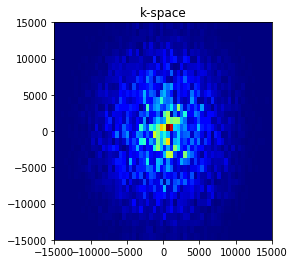
  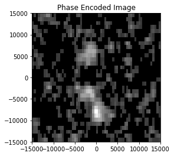
  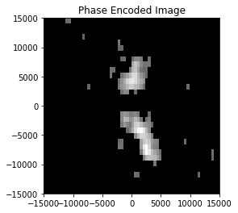
  <br>
  <em>Final result: measured k-space, 2D-FFT reconstruction, and thresholded image of a two-object phantom.</em>
</p>

---

## Table of contents

1. [Overview](#overview)
2. [Goals](#goals)
3. [Preparation](#preparation)
4. [System architecture](#system-architecture)
5. [Implementation](#implementation)
6. [Results](#results)
7. [Lessons learned](#lessons-learned)
8. [Limitations and future work](#limitations-and-future-work)
9. [Getting started](#getting-started)
10. [Repository structure](#repository-structure)

---

## Overview

This project explores how MRI works by building a small system from the ground up. Using two **Digilent Analog Discovery 2 (AD2)** boards, a low-field permanent magnet (≈ 3.32 MHz proton resonance), and our own control and reconstruction code, we implemented each stage of the imaging chain ourselves to understand the physics and engineering behind it.

The starting signal is a spin echo from a water phantom: a few millivolts, a few milliseconds long, right after volt-level RF pulses. We built the full chain from that signal to an image: pulse sequencing, RF front end, signal processing, shimming, gradient encoding, and reconstruction.

**Key outcomes**

- A software-defined MRI system controlled from one Python GUI
- RF coil matched to 50 Ω (S11 = **−34.8 dB** at 3.30 MHz)
- Spin echo at **3.318 MHz** with **26 dB** time-domain SNR
- Linewidth reduced from **1953 Hz to ~1220 Hz** by shimming
- A first image by **32-angle projection reconstruction**
- A final **32 × 64 phase-encoded image** matching the phantom layout

---

## Goals

| # | Objective | Success criterion |
| --- | --- | --- |
| 1 | Build a spectrometer from general-purpose instruments | RF, receiver gating, and digitization synchronized to microseconds |
| 2 | Detect a spin echo | Echo clearly above noise at a known frequency |
| 3 | Improve signal quality | Narrower linewidth and higher SNR |
| 4 | Encode spatial information | Calibrated gradients that match the requested resolution |
| 5 | Produce a 2D image | Reconstruction that matches the phantom geometry |

---

## Preparation

We characterized every hardware block on the bench before imaging, rather than relying on nominal values.

### Hardware

| Component | Role |
| --- | --- |
| 2 × Digilent AD2 | #1: RF transmit, LO, digitizer, timing. #2: gradients and shims |
| Permanent magnet | B₀ field, ≈ 3.32 MHz proton resonance |
| Hand-wound solenoid coil | RF transmit and receive |
| Attenuator, T/R switch | Pulse shaping and receiver protection |
| Preamp, 3.5 MHz low-pass, mixer | Receive chain and down-conversion |
| Gradient and shim coils, amplifier (gain ≈ 11) | Spatial encoding and field correction |
| NanoVNA, Hall probe | Coil and B₀ measurements |

<p align="center">
  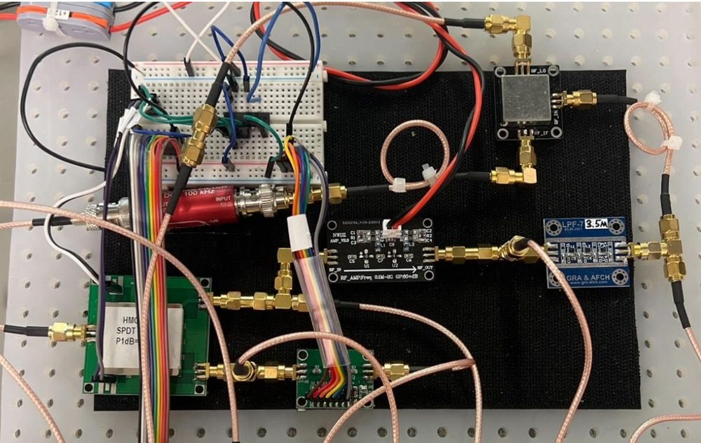
  <br>
  <em>RF front end: attenuator, T/R switch, preamp, 3.5 MHz low-pass filter, and mixer.</em>
</p>

### Hardware characterization

| Block | Key result |
| --- | --- |
| Attenuator | Switches 0 ↔ 6 dB in ~180 ns; ~1.8 dB extra loss, flat with drive level |
| T/R switch | Loss falls from ~5.8 dB (≤ 2 V) to ~2.9 dB (5 V), which set our usable RF amplitude |
| Receive chain | Noise 1.12 mV (digitizer) → 5 mV (after preamp); low-pass loss ≈ 10.25 dB; best LO drive 1.5 V; 50 Ω termination lowers noise |
| RF coil | Measured 0.76 + j56.6 Ω (vs. 1.71 + j102.6 Ω estimated); matched to 49.5 − j1.75 Ω with empirically tuned capacitors (517 / 47 pF); Q ≈ 74 |
| Magnet | Hall-probe B₀ map to estimate the Larmor frequency and uniformity |

| Transmit-path insertion loss | Matched coil (NanoVNA) |
| :---: | :---: |
| 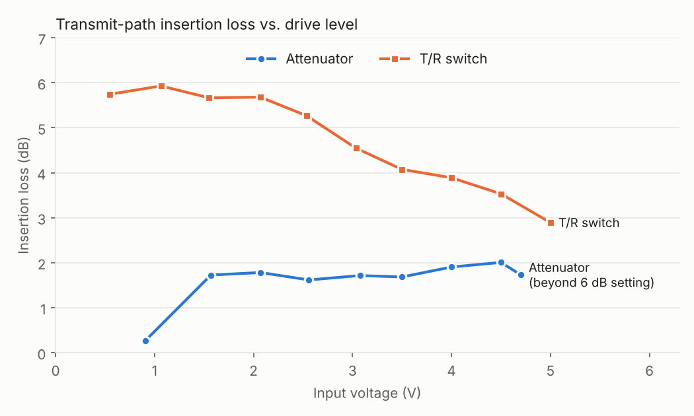 | 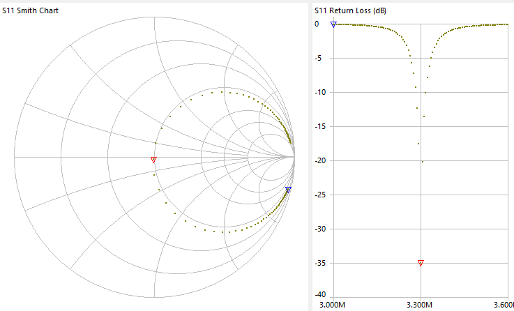 |

### Signal and timing groundwork

- **RF pulse bandwidth.** A 16-lobe sinc pulse (first zero at 187.5 µs) excites a flat ~10.7 kHz band. Pulse length trades directly against bandwidth.
- **Sampling.** A 1 MHz tone sampled at 250 kS/s aliased, so we down-mix the echo and sample at 1 MS/s over 8.192 ms (122 Hz bins).
- **Custom waveforms.** Programmable ramps (length, delay, shape, channel) became the gradient lobes.
- **First sequence.** Two RF pulses (TE = 6 ms), a ramp waveform, and T/R and pulse-control lines formed the skeleton of the imaging sequence.

<table>
  <tr>
    <th>Sinc pulse</th>
    <th>Its spectrum</th>
  </tr>
  <tr>
    <td align="center">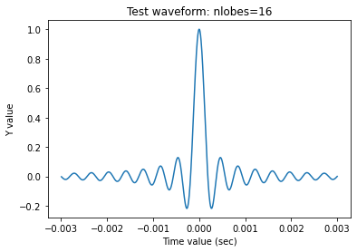</td>
    <td align="center">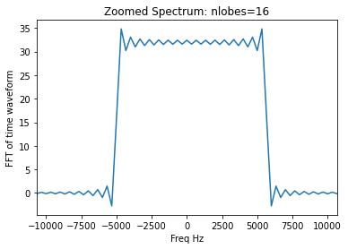</td>
  </tr>
  <tr>
    <th>Two-pulse sequence</th>
    <th>Control lines</th>
  </tr>
  <tr>
    <td align="center">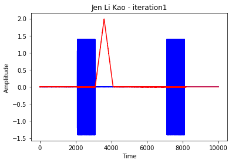</td>
    <td align="center">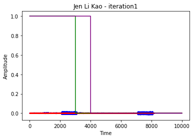</td>
  </tr>
</table>

---

## System architecture

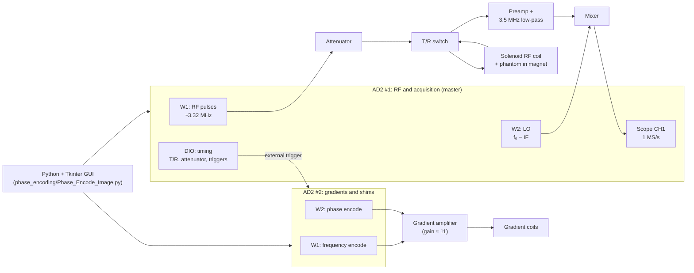

AD2 #1 is the master clock: its digital lines drive the attenuator, T/R switch, digitizer, and the trigger that starts the gradients on AD2 #2.

---

## Implementation

| Phase | Focus | Problem | Solution |
| --- | --- | --- | --- |
| 1 | Control software | Precise pulse and acquisition timing | AD2 driver layer and parameter GUI |
| 2 | Echo detection | Unknown resonance; noisy echo | Frequency sweep, heterodyne receiver, zero-phase filtering |
| 3 | Shimming | B₀ inhomogeneity broadens the line | DC shim offsets with linewidth feedback |
| 4 | Spatial encoding | Position-dependent frequency and phase | Calibrated, ramped gradient waveforms |
| 5 | Prototype imaging | First image | 32-angle projection reconstruction |
| 6 | Final imaging | Higher-fidelity 2D image | Phase encoding and 2D Fourier reconstruction |

### Phase 1: Control software and pulse sequence

A small driver layer (`set_wavegen`, `set_scope`, `set_dio`) controls both AD2s. The sequence is a spin echo, with the digitizer window centered on the echo:

```python
predelay = (TE / 2) - Tp                       # pulse centers TE/2 apart
Trig_AD2 = 3*predelay + 2.5*Tp - (Tacq/2)      # window centered on the echo
```

- **Two-board sync.** Both AD2s are armed, and AD2 #2's digital output must be configured explicitly before AD2 #1 fires; otherwise the gradient board misses the trigger.
- **Receiver protection.** The T/R switch (DIO 2) opens 50 µs before the first pulse and closes 110 µs after the second, covering coil ring-down.
- **GUI.** A Tkinter panel takes the sequence parameters, updates predelay, sample count, gradient strength, and AD2 voltage live, and saves or loads parameter sets as CSV.

### Phase 2: Echo detection and signal conditioning

- **Resonance search.** A coarse sweep (3.2–3.6 MHz, 10 kHz steps) and a fine sweep (3.30–3.34 MHz, 2 kHz steps) located the echo at **3.318 MHz**.
- **Heterodyne receiver.** An LO offset from the RF frequency mixes the echo down to a low IF (100 kHz, later 200 kHz).
- **Filtering.** A 6th-order Chebyshev II band-pass, applied with zero-phase `filtfilt`, removes noise and the mixer DC offset without distorting phase. A Hamming window reduces spectral leakage.
- **Drive level.** Increasing RF amplitude from 1 V to 5 V improved the echo until it saturated. The best echo used 5 V, Tp = 200 µs, TE = 10 ms.

```python
b, a = cheby2(6, 40, [lowCut, highCut], btype="band")
rgdSamples_filt = filtfilt(b, a, rgdSamples)            # zero-phase
rgdSamples_win  = rgdSamples_filt * np.hamming(len(rgdSamples_filt))
```

| Raw capture | Filtered + windowed |
| :---: | :---: |
| 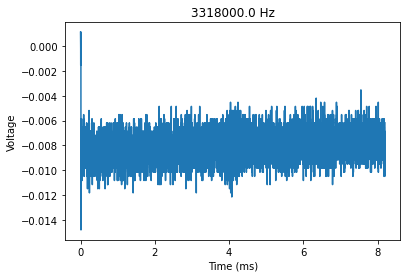 |  |
|  | 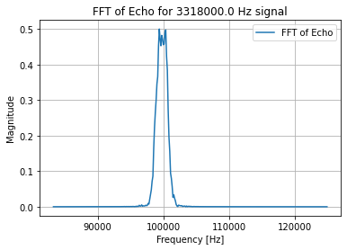 |

Automated analysis of the best echo gave T₂\* ≈ **0.28 ms**, an unshimmed linewidth of **2075 Hz (628 ppm)**, and SNR of **26 dB** (echo) vs. **7 dB** (spectrum).

| Echo decay | Linewidth (FWHM) |
| :---: | :---: |
| 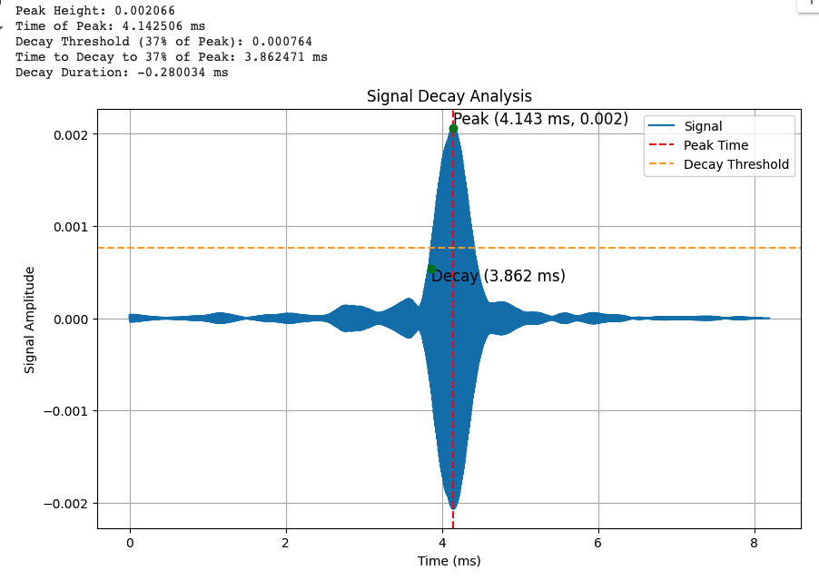 | 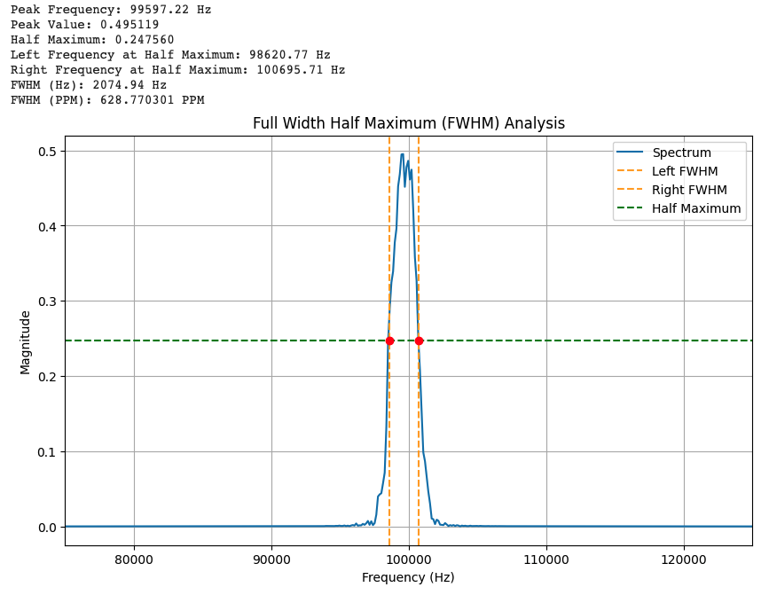 |

### Phase 3: Shimming

DC shim offsets on AD2 #2 (limited to ±0.2 V) correct B₀ inhomogeneity, with the FWHM linewidth as feedback. Shimming narrowed the line from **1953 Hz to ~1220 Hz**. For gradient broadening to exceed this by 10×, imaging needs about **447 Hz/mm (1.05 G/cm)**.

| Before shimming | After shimming |
| :---: | :---: |
| 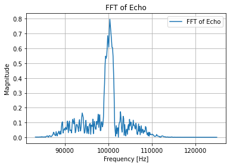 |  |

### Phase 4: Spatial encoding with gradients

AD2 #2 plays 4096-point gradient waveforms with linear ramps (`T_ramp`) to respect amplifier slew limits. The GUI converts target resolution to AD2 output voltage. Example for Tacq = 6.4 ms and 0.333 mm resolution:

| Step | Relation | Value |
| --- | --- | --- |
| Gradient | (1 / Tacq) / resolution ÷ 425.7 | 1.10 G/cm |
| Coil current | ÷ 0.5 G/cm per A | 2.2 A |
| Coil voltage | × 4 Ω | 8.8 V |
| AD2 output | ÷ amplifier gain 11 | 0.80 V |

The GUI values matched the hand calculation, and the oscilloscope confirmed the lobe timing. Single-axis tests spread the line to **5000 Hz (Z)** and **4531 Hz (X)** for the same setting, so we added an empirical `1.28 / 0.56` correction and per-axis scaling.

| GUI | Gradient lobes on the scope | Z gradient on |
| :---: | :---: | :---: |
| 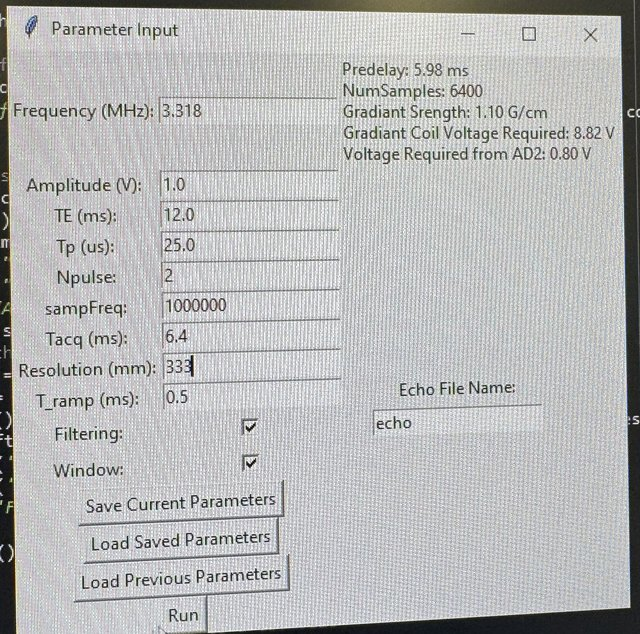 | 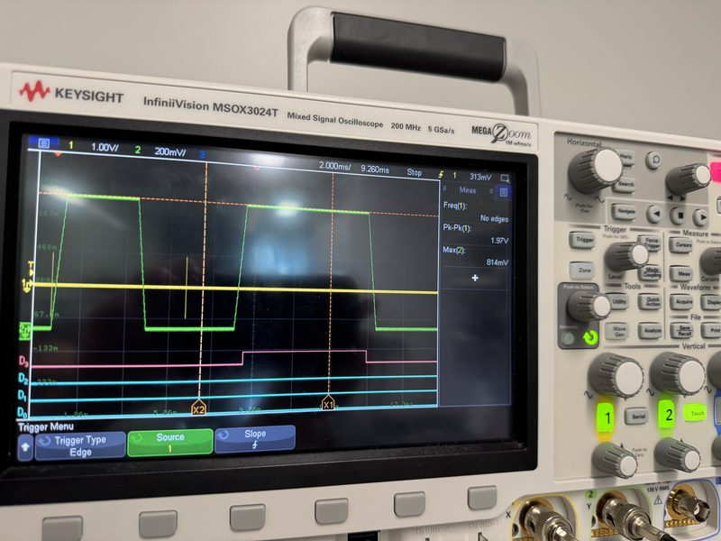 |  |

### Phase 5: Prototype imaging by projection reconstruction

Mixing the two gradient axes (sin θ, cos θ) rotates the readout direction, giving one projection per angle. Key refinements:

1. **Wider band-pass** (IF ± 10 → ± 40 kHz) to pass the gradient-broadened signal.
2. **Per-axis calibration** so projections have equal width at every angle.
3. **Projection centering.** Drift grew with angle (up to ~28 bins) and was removed per angle.
4. **Noise thresholding** at 20–30 % of each projection's peak.
5. **Backprojection** with `skimage.transform.iradon`, plain and Hamming-filtered.

With 8 angles the image is dominated by streaks; 32 angles fill it in.

| 8 projections: sinogram | 8 projections: backprojection |
| :---: | :---: |
| 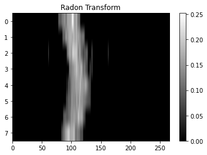 | 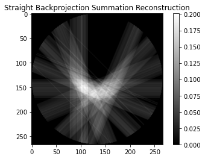 |

<table>
  <tr>
    <th>32 projections</th>
    <th>Sinogram</th>
  </tr>
  <tr>
    <td rowspan="3" align="center"></td>
    <td align="center"></td>
  </tr>
  <tr>
    <th>Backprojection</th>
  </tr>
  <tr>
    <td align="center">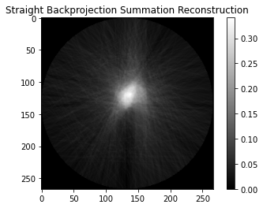</td>
  </tr>
</table>

Because every alignment or calibration error smears across the whole image, we moved to Fourier imaging.

### Phase 6: Final imaging with phase encoding

Each shot combines a **frequency-encode** gradient (dephase lobe, then readout centered on the echo) with a **phase-encode** lobe whose amplitude steps over 32 values. The grid is shifted so one step is exactly zero, ensuring the k-space center is sampled:

```python
Phase_encode_steps  = np.linspace(-Gpe_max, Gpe_max, 32)
Phase_encode_steps += np.min(np.abs(Phase_encode_steps))   # one step at zero
```

Zero-phase filtering is essential here, since position is encoded in the signal phase. Reconstruction ([`Phase_Encode_reconstruction.py`](phase_encoding/Phase_Encode_reconstruction.py)), first validated on a reference data set:

1. Keep 64 FFT bins around the 200 kHz IF.
2. Inverse-FFT each slice into one k-space line (32 × 64 matrix).
3. Apply a 2D Hamming window to suppress ringing.
4. 2D FFT, magnitude, and re-centering.
5. Zero pixels below 20 % of the maximum.

```python
k_space_data *= np.outer(np.hamming(32), np.hamming(64))
magnitude_image = np.abs(np.fft.fft2(k_space_data))
magnitude_image[magnitude_image <= 0.2 * np.max(magnitude_image)] = 0
```

---

## Results

| k-space | Raw reconstruction | After thresholding |
| :---: | :---: | :---: |
|  |  |  |
| Energy at the center | Objects over noisy background | Background removed |

The image matches the two-object phantom and is consistent across resolutions and projection counts. Residual artifacts in one object are likely due to magnet temperature drift or electromagnetic interference.

### Key metrics

| Metric | Value |
| --- | --- |
| Coil match | S11 = −34.8 dB at 3.30 MHz (VSWR 1.04), Q ≈ 74 |
| Resonance frequency | 3.318 MHz |
| Echo SNR (time / spectrum) | 26 dB / 7 dB |
| T₂\* | ≈ 0.28 ms |
| Linewidth (before / after shim) | 1953 Hz / ~1220 Hz |
| Gradient spread (Z / X, uncalibrated) | 5000 Hz / 4531 Hz |
| Projection reconstruction | 32 angles over 180° |
| Fourier image | 32 × 64 matrix |

### Signal-improvement summary

| Step | Method | Effect |
| --- | --- | --- |
| Frequency sweep | Coarse + fine RF sweep | Resonance found at 3.318 MHz |
| Down-mixing | LO at f₀ − IF | Echo at an easily sampled IF |
| Band-pass | Chebyshev II, `filtfilt` | Noise and DC removed, phase preserved |
| Windowing and averaging | Hamming window, repeated shots | Less leakage and noise |
| Shimming | DC offsets | Linewidth 1953 → ~1220 Hz |
| Gradient calibration | × 1.28 / 0.56, per-axis scale | Spread matches requested resolution |
| Projection centering | Per-angle shift | Sharper projection image |
| k-space apodization | 64 bins + 2D Hamming | Less noise and ringing |
| Thresholding | 20 % of max | Clean background |

Presentation slides: [`Final_Image_Result.pdf`](Final_Image_Result.pdf).

---

## Lessons learned

- **Timing is critical.** Pulses, gating, LO, digitizer, and gradients must align within microseconds; a single master trigger made this possible.
- **Measure, don't assume.** Matching capacitors, insertion losses, and gradient strengths all needed bench correction.
- **Preserve phase.** Zero-phase filtering and a sampled k-space center were essential for phase encoding.
- **Small errors accumulate.** Per-angle drift visibly blurred projection images until corrected.
- **Low field is sensitive to the environment.** Temperature drift and EMI remained the main limits.

---

## Limitations and future work

- **Resolution:** more phase-encode steps would sharpen the 32 × 64 image at the cost of scan time.
- **Stability:** magnet temperature control and RF shielding should reduce residual artifacts.
- **Automation:** shims and image re-centering were tuned by hand; automatic shimming and phase correction would add robustness.
- **Code structure:** each script repeats the AD2 helpers and GUI; a shared module would simplify maintenance.

---

## Getting started

**Requirements:** the hardware above; Python 3; [Digilent WaveForms](https://digilent.com/reference/software/waveforms/waveforms-3/start) with `dwfconstants.py` (from `WaveForms/samples/py/`) placed next to each acquisition script; and `pip install numpy scipy matplotlib scikit-image` (scikit-image is only needed for projection reconstruction).

| Stage | Script | Purpose |
| --- | --- | --- |
| Echo detection | [`echo_detection/echo_search.py`](echo_detection/echo_search.py) | Acquire and filter an echo; optional frequency sweep |
| Shimming | [`shimming/shim_and_gradient_test.py`](shimming/shim_and_gradient_test.py) | Shim offsets, gradient test, linewidth |
| Projection imaging | [`projection_imaging/projection_acquisition.py`](projection_imaging/projection_acquisition.py) | One projection per gradient angle |
| | [`projection_imaging/projection_reconstruction.py`](projection_imaging/projection_reconstruction.py) | Centering and backprojection |
| Phase encoding | [`phase_encoding/Phase_Encode_Image.py`](phase_encoding/Phase_Encode_Image.py) | Final 32-step acquisition |
| | [`phase_encoding/Phase_Encode_reconstruction.py`](phase_encoding/Phase_Encode_reconstruction.py) | 2D Fourier reconstruction |
| Tools | [`tools/gradient_calculator.py`](tools/gradient_calculator.py) | Standalone gradient calculator |

### Running the final scan

```bash
cd phase_encoding
python Phase_Encode_Image.py          # set parameters in the GUI, then press Run
python Phase_Encode_reconstruction.py # reads phase_encode_data/phase_encode_data_<n>_v1.txt
```

| Parameter | Default | Note |
| --- | --- | --- |
| Frequency (MHz) | 3.34 | Set to your measured resonance (ours: 3.318) |
| Amplitude (V) | 1 | RF amplitude |
| TE (ms) / Tp (µs) | 10 / 25 | Echo time / pulse width |
| sampFreq / Tacq (ms) | 1 000 000 / 8.192 | Sampling rate / acquisition window |
| Resolution | 333 | In µm (the GUI label reads "mm") |
| T_ramp (ms) | 5 | Gradient ramp time |
| Num Averages | 1 | Averages per phase-encode step |

Shim offsets (`offset0`, `offset1`, ±0.2 V max) are set in the code.

---

## Repository structure

```
.
├── echo_detection/       # Echo acquisition, filtering, frequency sweep
├── shimming/             # Shim offsets, gradient test, linewidth
├── projection_imaging/   # Projection acquisition and backprojection
├── phase_encoding/       # Final phase-encoded acquisition and reconstruction
├── tools/                # Standalone gradient calculator
├── images/               # README figures
├── Final_Image_Result.pdf
└── LICENSE
```

## Acknowledgements

Developed in the MR Engineering course at Texas A&M University (Fall 2024), which provided the magnet, RF front-end hardware, AD2 starter code, and reference data.

## License

Released under the [MIT License](LICENSE).
