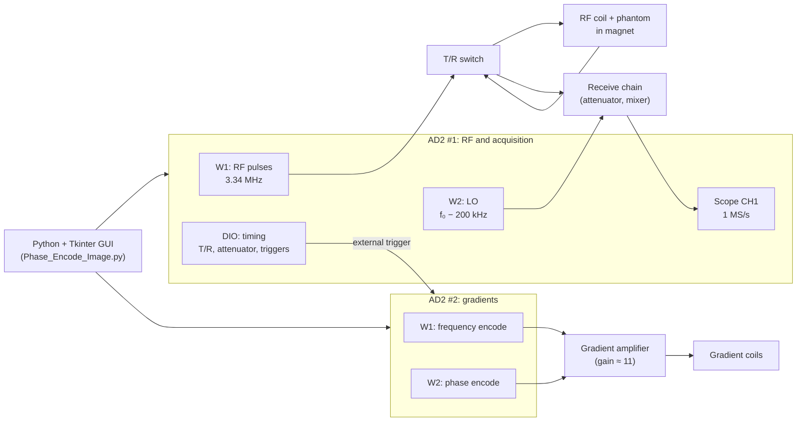

# Instrumentation and System Design for Advanced MRI Imaging

**Building a benchtop MRI scanner from scratch: from a faint echo to a 2D image of a phantom.**

This was a lab project for **ECEN 627 – MR Engineering** at Texas A&M University (Fall 2024). Over the semester we turned two **Digilent Analog Discovery 2 (AD2)** boards, a low-field magnet, and a few hundred lines of Python into a working MRI system. It transmits RF pulses, captures the spin echo, drives the gradient coils, and reconstructs an image of the phantom.

**Authors:** Austin Janszen, Jen Li Kao

<p align="center">
  
  
  
  <br>
  <em>Final result. Left to right: measured k-space, the raw reconstruction, and the cleaned-up image, where the two parts of the phantom are clearly visible.</em>
</p>

---

## Table of contents

1. [The challenge](#the-challenge)
2. [System architecture](#system-architecture)
3. [How we built it, step by step](#how-we-built-it-step-by-step)
4. [Results](#results)
5. [What we learned](#what-we-learned)
6. [Running the code](#running-the-code)
7. [Repository contents](#repository-contents)

---

## The challenge

A commercial MRI scanner uses a multi-tesla superconducting magnet and dedicated hardware worth millions of dollars. We had a low-field magnet (proton Larmor frequency ≈ **3.34 MHz**) and two USB oscilloscope/function-generator boards. The signal we wanted to see is a nuclear spin echo, only a few milliseconds long. It is far smaller than the RF pulses that create it, and it sits under noise from the room, the electronics, and the magnet's own field inhomogeneity.

Getting from that to a recognizable picture of the phantom meant solving several problems in order:

| # | Problem | Our solution |
| --- | --- | --- |
| 1 | Create and time a spin echo precisely | Software-defined pulse sequence on AD2 #1 |
| 2 | Keep the high-power RF pulse out of the receiver | Timed T/R switch and attenuator |
| 3 | A 3.34 MHz signal is hard to digitize cleanly | Down-mix to a 200 kHz IF with a software LO |
| 4 | The echo is buried in noise | Band-pass filter, windowing, averaging |
| 5 | Field inhomogeneity blurs the echo | DC shim currents |
| 6 | Encode *where* the signal comes from | Frequency- and phase-encoding gradients on AD2 #2 |
| 7 | Turn 32 echoes into an image | k-space assembly, 2D apodization, 2D FFT, thresholding |

---

## System architecture



AD2 #1 is the master clock. Its digital outputs fire the T/R switch, the attenuator, its own digitizer, and the external trigger that starts the gradient waveforms on AD2 #2, so every part of the sequence stays phase-locked from shot to shot.

---

## How we built it, step by step

### Step 1: Generating a spin echo

The core of MRI is the **spin echo**. An RF pulse tips the magnetization, the spins dephase, a second pulse refocuses them, and an echo appears a time TE later. We generate `Npulse = 2` sine bursts of width `Tp` on AD2 #1's W1 output, separated by a pre-delay derived from TE:

```python
predelay = (TE / 2) - Tp
set_wavegen(0, freq, amplitude, Tp, predelay, Npulse)   # RF: W1 on AD2 #1
```

All sequence parameters (frequency, TE, pulse width, sampling, resolution, and so on) go into a **Tkinter GUI**. It recalculates the derived timings and gradient voltages live as you type, and can save or load parameter sets as CSV. This made it easy to tune the system on the bench without editing code.

### Step 2: Protecting the receiver

The transmit pulse is volts; the echo is microvolts. If the receiver sees the pulse it saturates and hides the echo. We drive two protection signals from AD2 #1's digital I/O, which runs at a 10 µs time base:

```python
# T/R switch (DIO 2): opens before the first pulse, closes after the second, with safety margins
set_dio(2, totalCycles, predelay - 50e-6, 2*Tp + (predelay + 110e-6))

# Attenuator (DIO 3): active around the refocusing pulse
set_dio(3, totalCycles, 2*predelay, 3*Tp)
```

The 50 µs lead and 110 µs tail margins keep the receiver isolated during the pulses and while the coil rings down afterwards.

### Step 3: Bringing the signal down to a frequency we can digitize

Sampling a 3.34 MHz signal directly would push the AD2 to its limits. Instead we built a **heterodyne receiver**: AD2 #1's second output generates a local oscillator 200 kHz below the Larmor frequency, which mixes the echo down to an **intermediate frequency (IF) of 200 kHz**. A 1 MS/s capture then covers it comfortably.

```python
IF = 200e3
set_wavegen(1, (freq - IF), amplitude, Tacq, Echo_time, 1)    # LO: W2 on AD2 #1
```

The digitizer is triggered so that the acquisition window `Tacq` is **centered on the echo**:

```python
Trig_AD2 = 3*predelay + 2.5*Tp - (Tacq/2)
```

### Step 4: Pulling the echo out of the noise

The raw capture is noisy. Three processing steps make the echo usable:

1. **Band-pass filter.** A 6th-order Chebyshev type II filter passes IF ± 40 kHz with 40 dB stop-band rejection. We apply it with `filtfilt` (forward and backward), so it adds **no phase shift**. That matters because phase encoding stores spatial information in the signal phase.
2. **Hamming window.** This tapers the edges of the acquisition window to reduce spectral leakage in the FFT.
3. **Signal averaging.** We repeat the acquisition `Num Averages` times and average the spectra. Noise averages down while the echo adds up coherently.

```python
b, a = cheby2(6, 40, [lowCut, highCut], btype="band")
rgdSamples_filt    = filtfilt(b, a, rgdSamples)
rgdSamples_hamming = rgdSamples_filt * np.hamming(len(rgdSamples_filt))
averaged_fft      += fft(rgdSamples_hamming)
```

### Step 5: Shimming the magnet

An inhomogeneous B₀ field makes spins dephase faster, which broadens the spectral line and weakens the echo. We added X and Z **shim** offsets as DC voltages on AD2 #2. The software refuses offsets above ±0.2 V to protect the coils. We also kept a linewidth measurement (FWHM in Hz and ppm) in the code to evaluate the shim. It is still there, commented out.

### Step 6: Adding gradients for spatial encoding

To form an image, the signal frequency and phase must depend on position. AD2 #2 generates two custom 4096-point gradient waveforms, built sample by sample and triggered by AD2 #1:

- **Frequency encoding (W1):** a dephase lobe followed by a readout lobe centered on the echo.
- **Phase encoding (W2):** a trapezoidal lobe applied between the pulses and the readout.

Every lobe has linear ramps of `T_ramp` instead of sharp edges, which keeps the gradient amplifier and coils within their slew limits.

We derive the gradient amplitude from the target resolution, then convert it through our calibration chain to the voltage the AD2 must output:

```python
G_strength  = ((1/Tacq) / resolution) / 425.7     # theoretical gradient
G_strength *= 1.28 / 0.56                          # empirical calibration of our coil
V_grad      = 4 * (G_strength / 0.5)               # voltage into the gradient coils
V_AD2       = V_grad / 11                          # amplifier gain of 11
```

The `1.28 / 0.56` factor corrects the theoretical value to match our actual coil. Before each shot the script plots both gradient waveforms, so we could confirm the timing visually before anything was sent to the hardware.

### Step 7: Phase encoding: 32 lines of k-space

A single echo gives only a 1D projection. To get the second dimension we repeat the whole sequence **32 times**, stepping the phase-encode gradient from −G<sub>max</sub> to +G<sub>max</sub>:

```python
Npe = 32
Phase_encode_steps  = np.linspace(-Gpe_max, Gpe_max, Npe)
Phase_encode_steps += np.min(np.abs(Phase_encode_steps))   # make one step exactly zero
```

The second line is a small but important detail. A symmetric 32-point grid has no zero, so we shift it to make one step land exactly at zero. That way the **center of k-space**, where most of the signal energy lives, is actually sampled. Each step's averaged spectrum is saved to `phase_encode_data_<n>_v1.txt`.

### Step 8: Reconstructing the image

[`Phase_Encode_reconstruction.py`](Phase_Encode_reconstruction.py) turns the 32 saved spectra into an image:

1. **Isolate the signal.** Keep the 64 frequency bins around the 200 kHz IF, which removes most of the out-of-band noise.
2. **Build k-space.** Inverse-FFT each 64-bin slice back to the time domain to get one line of k-space, then stack the lines into a 32 × 64 matrix.
3. **2D Hamming apodization.** Multiplying k-space by `outer(hamming(32), hamming(64))` suppresses the Gibbs ringing caused by truncating k-space at so few samples.
4. **2D FFT.** Take the magnitude to get the image, then center it with `np.roll`.
5. **Threshold.** Zero every pixel below 20 % of the maximum, which removes the speckled background noise and leaves the phantom.

```python
k_space_data *= np.outer(np.hamming(Npe), np.hamming(64))
magnitude_image = np.abs(np.fft.fft2(k_space_data))
magnitude_image[magnitude_image <= 0.2 * np.max(magnitude_image)] = 0
```

---

## Results

| k-space | Raw reconstruction | After thresholding |
| :---: | :---: | :---: |
|  |  |  |
| Energy concentrated at the center, as expected | Phantom visible, but with a noisy background | Clean image showing both parts of the phantom |

- The reconstructed image **matched the geometry of the phantom**.
- Results stayed **consistent** when we changed the resolution and the number of projections.
- One phantom still showed residual artifacts. We suspect **environmental factors**, such as temperature drift of the magnet or electromagnetic interference in the lab.

The full summary is in [`Final_Image_Result.pdf`](Final_Image_Result.pdf).

---

## What we learned

- **Timing is everything.** The T/R switch, attenuator, LO, digitizer, and gradients all have to line up to within microseconds. Using one AD2 as a master trigger for the other made this possible.
- **Protect the phase.** Zero-phase filtering (`filtfilt`) and an exactly sampled k-space center were essential for phase encoding to work.
- **Calibrate against reality.** Theoretical gradient strengths had to be corrected with a measured calibration factor before the image scaled correctly.
- **Signal processing makes the image.** Down-mixing, filtering, windowing, averaging, apodization, and thresholding each contributed visibly to the final image.
- **Low-field MRI is sensitive to its environment.** Temperature and EMI remain the main limits on image quality.

---

## Running the code

### Requirements

- **Hardware:** 2 × Digilent Analog Discovery 2, low-field magnet, RF coil, T/R switch, attenuator, mixer, and gradient coils with an amplifier (gain ≈ 11)
- **Software:** Python 3, [Digilent WaveForms](https://digilent.com/reference/software/waveforms/waveforms-3/start), and `dwfconstants.py` from the WaveForms SDK samples (`WaveForms/samples/py/`) placed next to the scripts
- **Python packages:** `pip install numpy scipy matplotlib` (`tkinter` ships with Python)

### 1. Acquire

```bash
python Phase_Encode_Image.py
```

Set the parameters in the GUI and press **Run**:

| Parameter | Default | Meaning |
| --- | --- | --- |
| Frequency (MHz) | 3.34 | Larmor / RF frequency |
| Amplitude (V) | 1 | RF amplitude |
| TE (ms) | 10 | Echo time |
| Tp (µs) | 25 | RF pulse width |
| Npulse | 2 | Number of RF pulses |
| sampFreq | 1 000 000 | Digitizer sample rate (Hz) |
| Tacq (ms) | 8.192 | Acquisition window |
| Resolution (mm) | 333 | Target resolution (sets gradient strength) |
| T_ramp (ms) | 5 | Gradient ramp time |
| Num Averages | 1 | Averages per phase-encode step |
| Filtering / Window / Gradient / Shim | on | Enable each stage |

The last-used parameters are stored in `Recent.csv`. The scan writes `phase_encode_data_0_v1.txt` … `phase_encode_data_31_v1.txt`.

### 2. Reconstruct

Edit `directory` in `Phase_Encode_reconstruction.py` to point at the folder with the data files, then run:

```bash
python Phase_Encode_reconstruction.py
```

---

## Repository contents

| File | Description |
| --- | --- |
| [`Phase_Encode_Image.py`](Phase_Encode_Image.py) | Acquisition: parameter GUI, AD2 control, pulse sequence, gradients, shims, filtering, data capture |
| [`Phase_Encode_reconstruction.py`](Phase_Encode_reconstruction.py) | Reconstruction: k-space assembly, 2D apodization, 2D FFT, thresholding |
| [`Final_Image_Result.pdf`](Final_Image_Result.pdf) | Results slides |
| [`images/`](images) | Figures used in this README |

## License

Released under the [MIT License](LICENSE).
